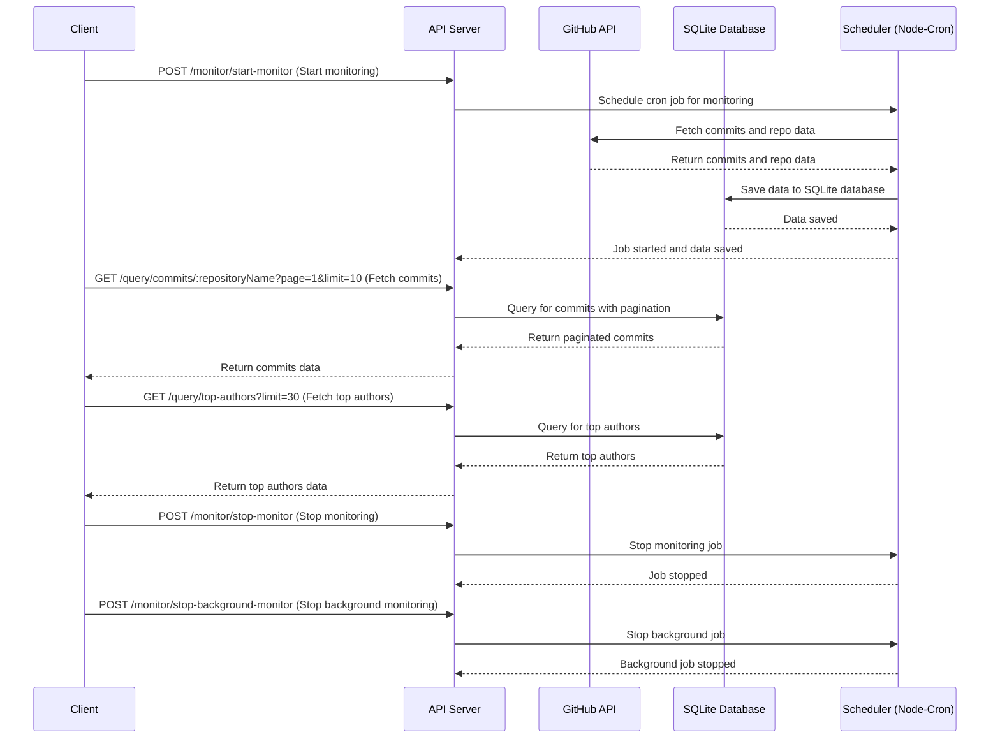

# Sequence Diagram

```mermaid
sequenceDiagram
    participant Client
    participant APIServer as API Server
    participant GitHubAPI as GitHub API
    participant Database as SQLite Database
    participant Cron as Scheduler (Node-Cron)

    Client->>APIServer: POST /monitor/start-monitor (Start monitoring)
    APIServer->>Cron: Schedule cron job for monitoring
    Cron->>GitHubAPI: Fetch commits and repo data
    GitHubAPI-->>Cron: Return commits and repo data
    Cron->>Database: Save data to SQLite database
    Database-->>Cron: Data saved
    Cron-->>APIServer: Job started and data saved

    Client->>APIServer: GET /query/commits/:repositoryName?page=1&limit=10 (Fetch commits)
    APIServer->>Database: Query for commits with pagination
    Database-->>APIServer: Return paginated commits
    APIServer-->>Client: Return commits data

    Client->>APIServer: GET /query/top-authors?limit=30 (Fetch top authors)
    APIServer->>Database: Query for top authors
    Database-->>APIServer: Return top authors
    APIServer-->>Client: Return top authors data

    Client->>APIServer: POST /monitor/stop-monitor (Stop monitoring)
    APIServer->>Cron: Stop monitoring job
    Cron-->>APIServer: Job stopped

    Client->>APIServer: POST /monitor/stop-background-monitor (Stop background monitoring)
    APIServer->>Cron: Stop background job
    Cron-->>APIServer: Background job stopped
```
